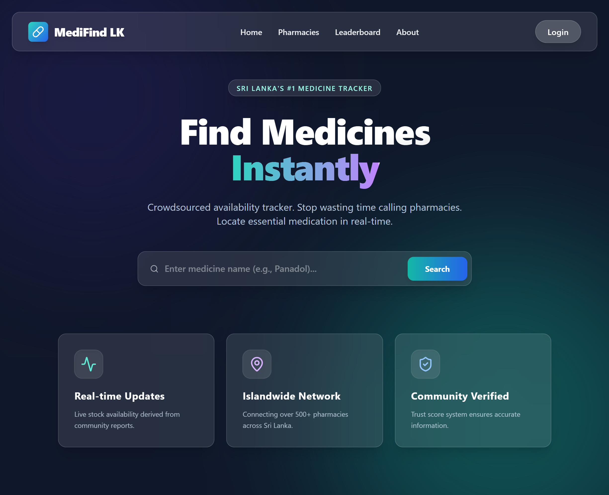
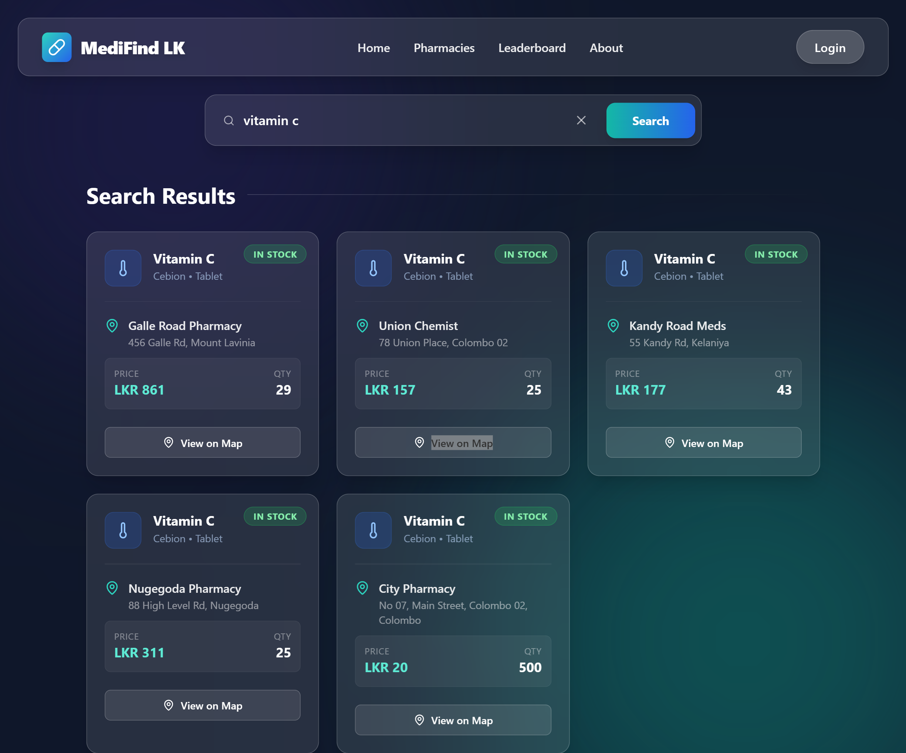
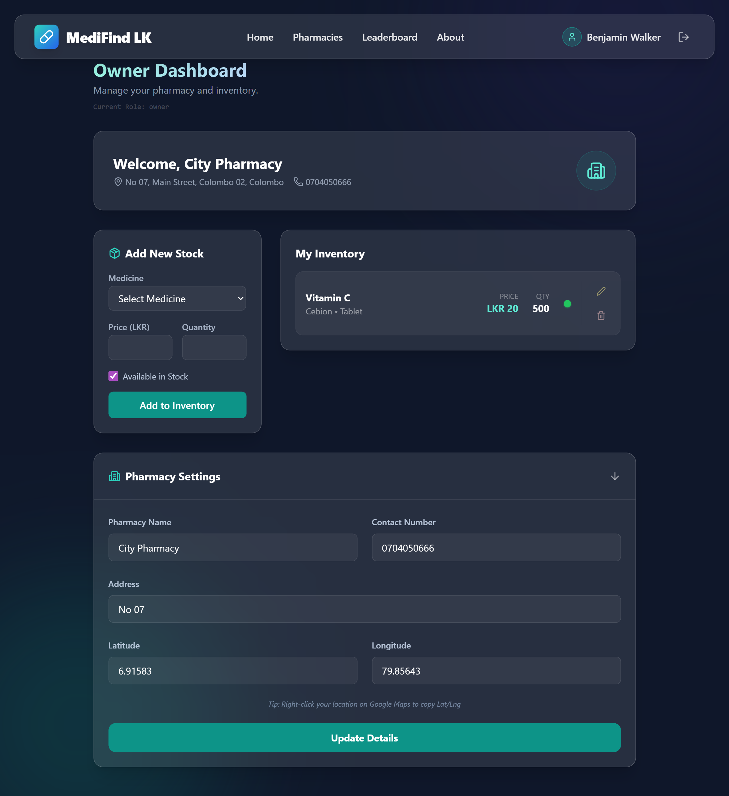
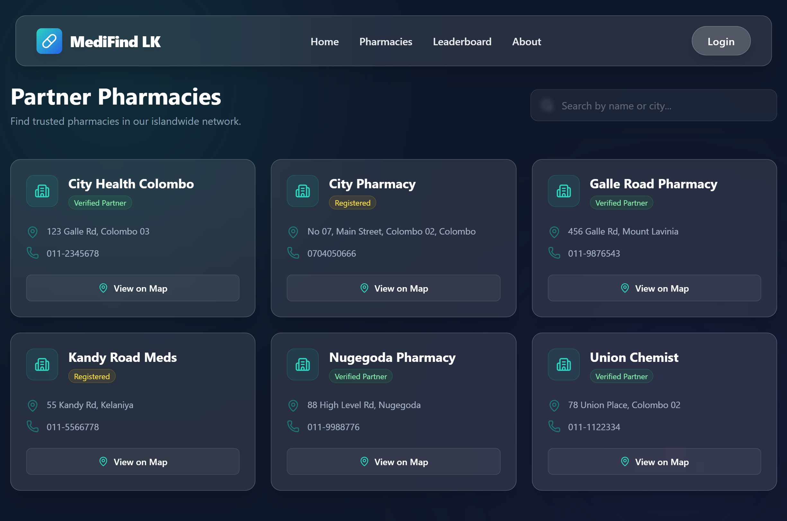
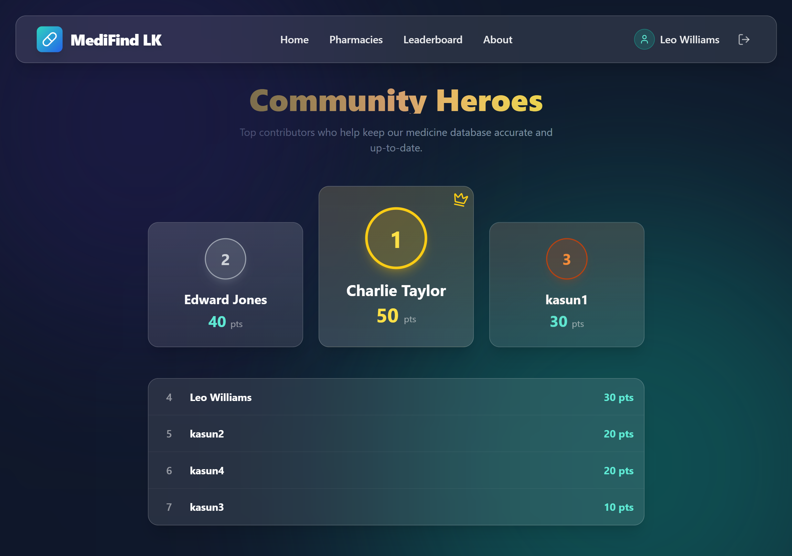

# 💊 MediFind LK - Sri Lanka's #1 Community Medicine Tracker

> **"Stop calling pharmacies one by one. Find essential medicines instantly."**

**MediFind LK** is a real-time, crowdsourced platform designed to solve medicine shortages in Sri Lanka. Think of it as **"Waze for Medicines"**—where the community helps each other find stock availability in real-time.

---

## 🚀 Live Demo
### 🌐 [Click here to visit MediFind LK](https://medifind-lk.vercel.app)

---

## 📸 Project Showcase

Here is a glimpse of how MediFind LK works:

| **Landing Page** | **Smart Search Results** |
|:---:|:---:|
|  |  |
| *Modern Hero Section designed for quick access* | *Instant availability check & price comparison* |

| **Pharmacy Dashboard** | **Interactive Maps** |
|:---:|:---:|
|  |  |
| *Inventory management for Pharmacy Owners* | *Direct navigation to trusted pharmacies* |

| **Community Leaderboard** |
|:---:|
|  |
| *Gamified system rewarding top contributors* |

---

## 🌟 Key Features

### 🔍 For the General Public (Users)
* **Real-time Search:** Instantly find which pharmacy has the medicine you need.
* **📍 Live Map Integration:** View pharmacy locations on Google Maps with one click.
* **🚦 Crowdsourcing (Waze-Style):** Users can "Confirm Stock" or "Report Out of Stock" to help others.
* **🏆 Gamification:** Earn points for every contribution and climb the "Community Heroes" leaderboard.
* **📱 Responsive Design:** A seamless experience on both Mobile and Desktop.

### 🏥 For Pharmacy Owners
* **Dedicated Dashboard:** Manage inventory with a simple Add/Delete/Update interface.
* **Digital Visibility:** Get discovered by thousands of users instantly without marketing costs.
* **Location Management:** Set precise GPS coordinates for customers to find you easily.

---

## 🛠️ Tech Stack

This project was built using the **MERN Stack** for high performance and scalability.

* **Frontend:** React.js, Vite, Tailwind CSS, Framer Motion, React Hot Toast.
* **Backend:** Node.js, Express.js.
* **Database:** MongoDB Atlas (Cloud Database).
* **Authentication:** JWT (JSON Web Tokens) with Role-Based Access Control (User/Owner).
* **Deployment:** Vercel (Frontend & Serverless Backend).

---

## 🏗️ Installation & Setup

Want to run this locally? Follow these steps:

### 1. Clone the Repository

git clone https://github.com/kavi419/medifind-lk.git
cd medifind-lk

2. Install Dependencies
You need to install dependencies for both the root (backend) and client (frontend).

# Install Backend Dependencies
npm install

# Install Frontend Dependencies
cd client
npm install
cd ..

3. Environment Variables (.env)
Create a .env file in the root directory and add your credentials:

MONGODB_URI=your_mongodb_connection_string
JWT_SECRET=your_secret_key
PORT=3000

4. Run the Project
You can run both Frontend and Backend concurrently.

# From the root directory
npm run dev

Visit http://localhost:5173 to view the app.

💡 The "Why" Behind MediFind
During critical times in Sri Lanka, finding essential medicine was a massive challenge. People had to travel from pharmacy to pharmacy, wasting fuel and time.

MediFind LK solves this by:

Centralizing Data: Bringing scattered pharmacy stock info into one place.

Empowering the Community: Allowing anyone to update stock status, ensuring data is fresh even if the pharmacy owner is busy.

👨‍💻 Developer
Developed by Kavindu IT Undergraduate at SLIIT

🐙 [GitHub Profile](https://github.com/kavi419)  

📧 [Email](mailto:kavindu2002nethmina@gmail.com)

 Made with ❤️ in Sri Lanka 🇱🇰 

